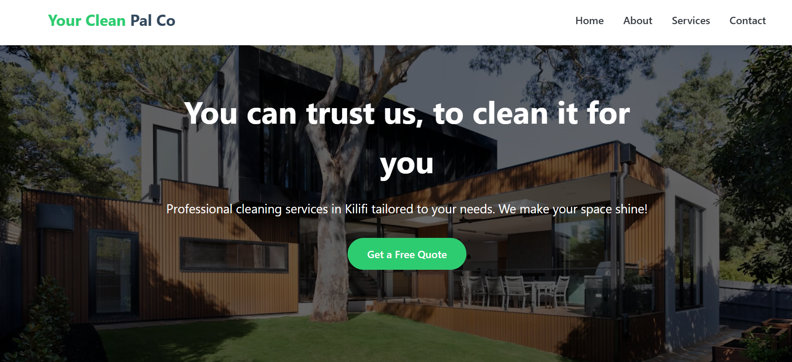
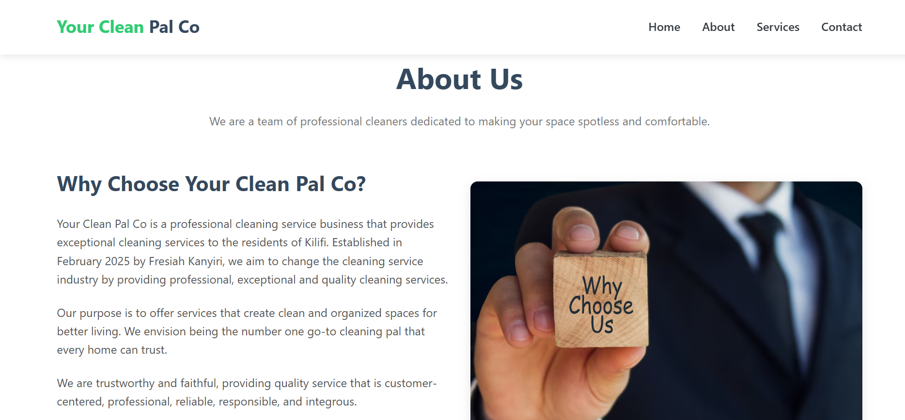
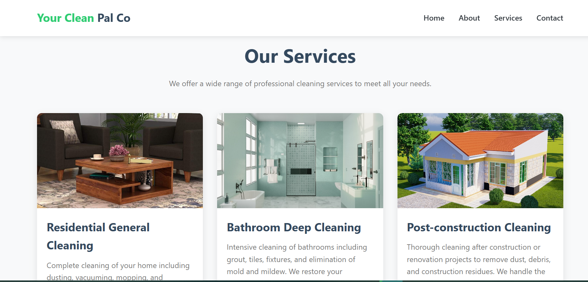
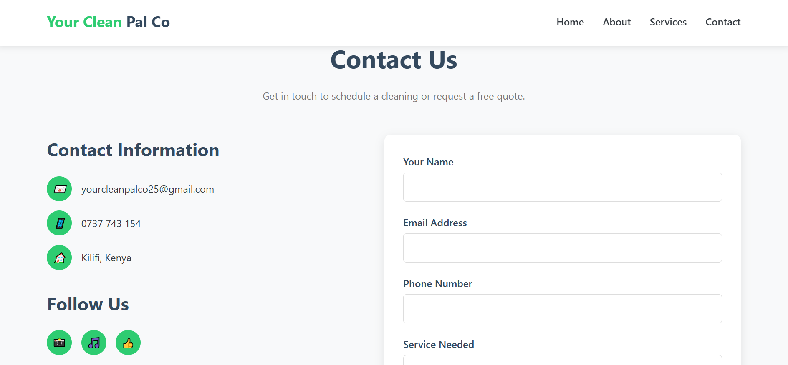

# Your Clean Pal Co - Professional Cleaning Services Website

A modern, responsive website for Your Clean Pal Co, a professional cleaning service based in Kilifi, Kenya. The website showcases services, company information, and provides a contact form for potential clients.

## Features

- **Responsive Design**: Works on all devices from mobile to desktop
- **Hamburger Menu**: Mobile-friendly navigation
- **Service Showcase**: Clean presentation of all cleaning services
- **Contact Form**: Easy way for clients to request quotes
- **Smooth Scrolling**: Enhanced user experience for navigation
- **Modern UI**: Clean, professional design with attractive color scheme

## Technologies Used

- HTML5
- CSS3 (with CSS Variables for theming)
- Vanilla JavaScript
- Responsive Design (Mobile First approach)

## Color Scheme

| Color          | Hex Code  | Usage               |
|----------------|-----------|---------------------|
| Luminous Green | `#2ecc71` | Primary brand color |
| Dark Blue      | `#34495e` | Secondary color     |
| Mustard Yellow | `#f1c40f` | Accent color        |
| Light Gray     | `#f8f9fa` | Background          |
| Dark Gray      | `#343a40` | Text                |

## Sections

1. **Hero Section**: Attractive header with call-to-action
2. **About Us**: Company information and mission
3. **Services**: Showcase of cleaning services with images
4. **Contact**: Contact form and company information
5. **Footer**: Additional navigation and copyright

## Installation

No installation required - this is a static website. Simply open `index.html` in any modern web browser.

## How to Customize

1. **Images**: Replace placeholder images in the `img/` folder
2. **Content**: Edit text directly in the HTML file
3. **Colors**: Modify the CSS variables in the `:root` selector
4. **Form Handling**: Update the form submission JavaScript (currently shows an alert)

## Form Submission

Currently, the form shows a success alert but doesn't actually submit data. To implement real form submission:

1. Set up a form handling service (like Formspree, Netlify Forms, or a custom backend)
2. Update the `form` element's `action` attribute
3. Modify the JavaScript form submission handler

## Browser Support

The website supports all modern browsers including:

- Chrome (latest)
- Firefox (latest)
- Safari (latest)
- Edge (latest)

## Future Improvements

- Add a gallery section showcasing before/after cleaning photos
- Implement a booking system
- Add customer testimonials
- Create a blog section with cleaning tips
- Add multilingual support

## Contact

For questions or support, please contact:

Your Clean Pal Co  
Email: [yourcleanpalco25@gmail.com](mailto:yourcleanpalco25@gmail.com)  
Phone: +254 737 743 154  
Location: Kilifi, Kenya  

Social Media:  
[Instagram](https://www.instagram.com/yourcleanpalco25) | 
[TikTok](https://www.tiktok.com/@your.cleaning.pal) | 
[Facebook](https://www.facebook.com/share/19cb2XM1v9/)
This README includes:

Project overview

Key features

Technology stack

Design elements (color scheme)

Website structure

Setup instructions

Customization guide

Form handling information

Browser compatibility

Future enhancement ideas

License information

Contact details

Screenshots:
Home Page

About Page

Services Page

Contact Page
